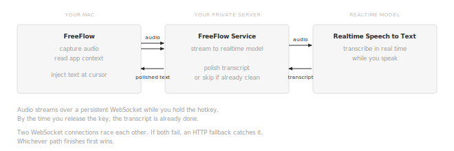

# FreeFlow – seamless speech to text in any app

Press a hotkey, dictate naturally, polished text appears in any app.

Ramble, use filler words, correct yourself mid-sentence. FreeFlow turns messy
speech into clean writing and injects it wherever your cursor is: your messaging app,
your editor, your coding agent, the terminal, email, anything.

It is open source, so you have the [freedom to customize](CUSTOMIZE.md) it any way you want. You deploy it
on a server private to you, so your audio and data flow through infrastructure
you control.

One deployment serves your entire team with no per-seat fees.

## Demo (sound on 🔊)

In this demo, you'll hear rambling speech with filler words and corrections. Watch what appears at the cursor.

https://github.com/user-attachments/assets/01540422-c6e1-404d-a86d-fa3a4ac96772

## Install

Install the macOS app with [Homebrew](https://brew.sh) or [download the DMG](https://github.com/build-trust/freeflow/releases/latest/download/FreeFlow.dmg) directly.

```
brew install build-trust/freeflow/freeflow
```

On first launch, FreeFlow deploys the code in this repo to a private server for you in [Autonomy](https://autonomy.computer). You don't need to know anything about servers or cloud infrastructure. The whole setup takes about two minutes. Invite your team from the app and they can start dictating right away.

## Instant, polished, and accurate

It feels instantaneous. Two thirds of dictations complete in under 0.6 seconds ([benchmarks](BENCHMARK.md)):

<p align="center">
  
</p>

Audio streams to your private server over a persistent WebSocket while you speak.
The server forwards it to a realtime model, which transcribes incrementally. By the
time you release the key, the transcript is already done. A skip heuristic
bypasses the polish step entirely for clean transcripts (roughly 40% of dictations).
When polish is needed, a fast model handles it in about 0.4 seconds.

Two independent WebSocket connections are kept warm: a primary that streams
audio during recording, and a standby that races the primary with the full
audio buffer when you release the key. If both WebSockets fail, an HTTP batch
fallback catches it. Whichever path finishes first wins.

<p align="center">
  
</p>

## Freedom: open, private, and unlimited

Everything is in this repo: the app, the server, the deployment
configuration. Change the models, rewrite the prompts, add a language, or
fork the whole thing. Your team's audio, transcripts, and context data flow through your private FreeFlow Server deployed in [Autonomy](https://autonomy.computer).

One container handles your entire team with no per-seat fees. In our
[concurrent users benchmark](BENCHMARK.md), 50 people dictating
simultaneously produced sub-second median latency with zero failures.
Each dictation only occupies the server for a few seconds, so 50
concurrent slots supports hundreds of users in practice. The economics
improve as you add people because the infrastructure cost is small and fixed.

## Customize for your team

FreeFlow is designed to be taken apart and reassembled. Swap the speech
model, rewrite the polish prompt, add a language, or change how text is
injected. See [CUSTOMIZE.md](CUSTOMIZE.md).

## Contribute

Jump in, we'd love your help.

The single most useful contribution right now is
[mic compatibility data](https://github.com/build-trust/freeflow/issues/2).
FreeFlow works well with built-in mics and AirPods, but every USB mic,
headset, and audio interface is different. The app's "Contribute Mic
Data" menu item generates a one-click diagnostic report that
can help us improve accuracy of dictation for everyone.

Want to add or improve support for a language? [Here's how.](https://github.com/build-trust/freeflow/issues/1) Found an app where injection breaks? Open an issue. Code contributions and pull requests are welcome too. [DEVELOP.md](DEVELOP.md) has the build and test guide.
